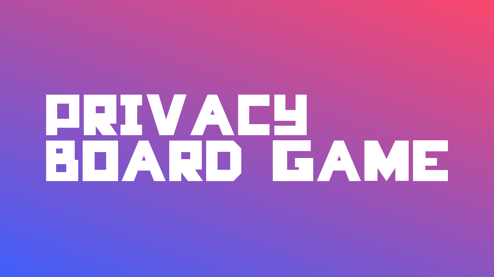

Privacy Board Game
======================
***Welcome to our project repository!*** 🎉🆙

The **Privacy Board Game** is a open, offline, extensible and board game to explore and analyze everyday situations on the Internet and learn how to navigate safely using good online security and privacy practices.

#Getting Started
## Game play now!
1. Download the board on your language: [[English](https://github.com/itidigitalbr/privacy-board-game/raw/master/board/privacy_board_game_english.pdf)] [[Portuguese](https://github.com/itidigitalbr/privacy-board-game/raw/master/board/privacy_board_game_portuguese.pdf)] [[Spanish](https://github.com/itidigitalbr/privacy-board-game/raw/master/board/privacy_board_game_spanish.pdf)] [German] [French]
2. Print or draw by hand the board based on PDF file.
3. Check the **"Let's Play"** on board game that includes tips, prepatives and rules.
4. Start playing!

## Remixing
### Remix and create my own
This game is extensive, this means you can remix the game and create your own situations and cards to challenge your friends! You can engage everyone to remix and co-create a new game from this, this allows you to create unlimited fun, go beyond the border and the ***sky is the limit possibilities***! **There are two ways to remix:**

### Remixing by hand
1. Download the [white board game](https://github.com/itidigitalbr/privacy-board-game/raw/master/board/privacy_board_game_remix_your_own.pdf)
2. Print or draw by hand the board based on PDF file
3. Using markers write the situations risks on the white board game and solutions on the white cards.
4. Check the **"Let's Play"** on board game that includes tips, prepatives and rules.
5. Start playing!

### Remixing using vector software
1. Download the [game board](https://github.com/itidigitalbr/privacy-board-game/tree/master/board) source files and fonts.
2. Download and install the [fonts](https://github.com/itidigitalbr/privacy-board-game/blob/master/board/fonts.md).
3. Open one of source files using [vector software](http://www.creativebloq.com/illustrator/alternative-to-illustrator-1131664).
4. Edit all text boxes on the board and cards by adding your own situations and solutions to them (if you're using the Illustrator, [unlock the layers](https://helpx.adobe.com/illustrator/using/locking-hiding-deleting-objects.html) before).
5. Save, print and start playing!

***The first situation is done, it is an example/template to follow.***

# Contributing

## Translate to your language
1. Download the [game board](https://github.com/itidigitalbr/privacy-board-game/tree/master/board) source files and fonts.
2. Download and install the [fonts](https://github.com/itidigitalbr/privacy-board-game/blob/master/board/fonts.md).
3. Open one of source files using [vector software](http://www.creativebloq.com/illustrator/alternative-to-illustrator-1131664)
4. Edit the text by translating into your language (if you're using the Illustrator, [unlock the layers](https://helpx.adobe.com/illustrator/using/locking-hiding-deleting-objects.html) before).
5. When finished, save the file to your computer, upload it to your personal cloud account ([Google Drive](https://drive.google.com), [Dropbox](https://dropbox.com) are good options), get the public link to download the file using your cloud service, **[open an issue](https://github.com/barrosgeraldo/mozsprint-privacy-security-situations/issues/new)** informing that you translated and add the download link.

***We really appreciate your support translating this game, this will enable people in your region to learn about privacy and security in their own local languages.***

## Start with an issue
Our project is open to contributions!

All the tasks are open for contribution, they are documented through our [issues](https://github.com/itidigitalbr/privacy-board-game/issues), [milestones](https://github.com/itidigitalbr/privacy-board-game/milestones) and [projects](https://github.com/itidigitalbr/privacy-board-game/projects) panel!

**Want to start? Choose one of the areas to see our open tasks and choose one!**
- [Marketing](https://github.com/itidigitalbr/privacy-board-game/milestone/5)
- [Design](https://github.com/itidigitalbr/privacy-board-game/milestone/1)
- [Education](https://github.com/itidigitalbr/privacy-board-game/milestone/3)
- [Web development](https://github.com/itidigitalbr/privacy-board-game/milestone/4)
- [Events production](https://github.com/itidigitalbr/privacy-board-game/milestone/2)

# Drop us a line
If you need send a private message to us, please ping us at "contato (@) itidigital (.) org".

# Participation Guidelines

This project adheres to a [code of conduct](CODE_OF_CONDUCT.md). By participating, you are expected to uphold this code. Please report unacceptable behavior to **[Geraldo Barros](http://telegram.me/geraldobarros)**.

# Credits
[Geraldo Barros](https://reps.mozilla.org/u/geraldobarros/), Game Creator & Illustration Design

[Cynthia Pereira](https://reps.mozilla.org/u/cynthiapereira/), Front-end Developer & Communication

[Cyb3ll3 Oliveira](https://mozillians.org/pt-BR/u/cyb3ll3/), Tests & Feedback

[Carolina Tejada](https://twitter.com/cctalvarez), Spanish L10n

[Chad Sansing](https://twitter.com/chadsansing), Challenge, Ideas & Resources

[Global Sprint Team](https://mozilla.github.io/global-sprint/), Network

# Supported by Mozilla
A project proudly part of [Offline Games Challenge](https://github.com/MozillaFoundation/mpa-offline-games-challenge), [Global Sprint](https://mozilla.github.io/global-sprint/) and [Open Leaders](https://mozilla.github.io/leadership-training/round-4/projects/#privacy-board-game) from [Mozilla](https://mozilla.org).
